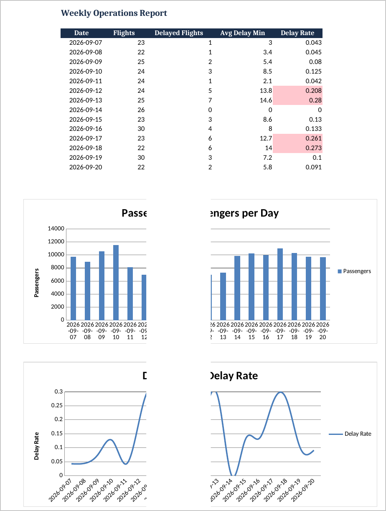

# Airport Operations Report Automation


A Python tool that replaces a manual weekly reporting cycle with one command.
It pulls from three operational data sources, aggregates the numbers,
evaluates alerting thresholds, and renders a formatted, charted Excel report.

Built as a demonstration of the automation approach used in real operations
environments — Python (Pandas, openpyxl, SQLite), multi-source integration,
and automated error logging with threshold alerts.



## Features

| Step | Detail |
|---|---|
| Ingest | SQL (SQLite ops DB) + API (REST endpoint or offline snapshot) + Excel workbook |
| Aggregate | Daily summary: flights, delay rate, avg delay, passenger volume (Pandas) |
| Alert | Flags days above the delay-rate threshold or below expected volume |
| Render | openpyxl workbook: styled tables, bar + line charts, conditional formatting |
| Monitor | Container-friendly logs (`logs/automation.log`), alert log, SMTP email alerts |

## Quick start

```bash
pip install -e .
python sample_data/generate_sample_data.py   # creates ./data (simulated sources)
ops-report                                   # or: python -m report_automation
```

The report is written to `reports/weekly_operations_report.xlsx`.

## Configuration

All settings are environment variables — copy `.env.example` to `.env` and
edit, or export variables directly. Common ones:

| Variable | Default | Purpose |
|---|---|---|
| `OPS_API_URL` | _(unset)_ | Live ops API endpoint; unset = read local snapshot |
| `OPS_DELAY_RATE_THRESHOLD` | `0.20` | Flag days where delay share exceeds this |
| `OPS_MIN_PASSENGERS` | `8000` | Flag days below this passenger volume |
| `OPS_ALERT_EMAIL` | _(unset)_ | On-call address for threshold alerts |
| `OPS_SMTP_HOST` | _(unset)_ | SMTP relay for alert email (SSL) |
| `OPS_LOG_LEVEL` | `INFO` | DEBUG, INFO, WARNING, ERROR |

CLI flags (`--output`, `--offline`, `--alert-email`, `--log-level`, `--env-file`)
override environment variables for a single run. Run `ops-report --help`.

## Architecture

```
run / ops-report / python -m report_automation
  └─ cli.py             argument parsing, env overrides
       └─ pipeline.py   orchestration + failure notification
            ├─ sources.py       SQL / API / Excel loaders (validated, retrying)
            ├─ reporting.py     aggregation (daily summary, event breakdown)
            ├─ alerts.py        threshold rules -> structured Alert objects
            ├─ notify.py        alerts.log + SMTP delivery
            └─ writer.py        openpyxl report rendering
```

## Development

```bash
pip install -e .[dev]
make check        # ruff + mypy + pytest
make sample-data
make run
```

## Production notes

- Point `OPS_API_URL` at the live ops API (`sources.py` handles timeouts,
  retries with backoff, and snapshot fallback).
- Wire `OPS_SMTP_HOST`/`OPS_SMTP_USER`/`OPS_SMTP_PASSWORD` to a real relay.
- Schedule with cron: `0 6 * * 1 ops-report` (Mondays 06:00), or run the
  included Dockerfile on any scheduler (Kubernetes CronJob, Airflow, etc.).
- Logs are written to stdout and `logs/automation.log`; use
  `WatchedFileHandler`-compatible rotation (logrotate) in long-running setups.

## Disclaimer

This repository demonstrates the automation architecture; sample data is
synthetic and generated locally. It contains no real operational data.
